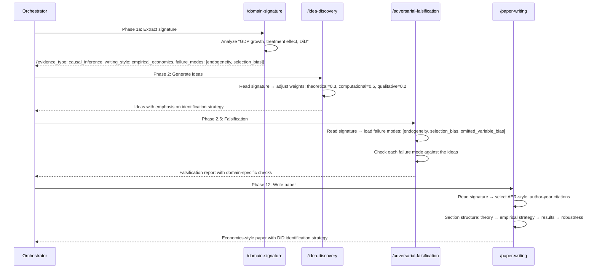

# Domain Signature Consumer Protocol (SciForge-OSS)

> **Status (v2.3 — wiring layer, v2.8 — learner-first downgrade of Phase 1a)**: Defines how every downstream skill consumes the domain signature produced by `/domain-learner` (Phase 1b). This is the **wiring layer** that makes domain adaptation automatic. `/domain-signature` (Phase 1a) is downgraded to an OPTIONAL hint file consumed only by the learner as a prior — downstream skills never read it.
>
> **Core principle**: Every skill reads `refine-logs/domain-signature.json` at startup and adapts its behavior accordingly. No skill hard-codes domain-specific logic.

## Quick Reference

- **Purpose**: 定义所有下游 skill 如何自动消费领域签名
- **Input**: refine-logs/domain-signature.json (from /domain-learner — 唯一真相源)
- **Output**: 各 skill 自适应行为 (无需手动配置)
- **Key**: 每个 skill 在启动时读取签名，自动适配；不读 hint 文件

## Signature Location

The domain signature is written to `refine-logs/domain-signature.json` by Phase 1b (`/domain-learner`) — the sole writer. Every downstream skill reads this file at startup. Phase 1a (`/domain-signature`) writes a separate `refine-logs/domain-signature-hint.json` consumed ONLY by the learner as a prior; downstream skills MUST NOT read the hint.

## Consumption Rules by Skill

### /idea-discovery — Perspective Weight Adjustment

```json
{
  "signature_consumption": {
    "field": "evidence_type",
    "mapping": {
      "causal_inference": {
        "perspective_weights": {"theoretical": 0.3, "computational": 0.5, "qualitative": 0.2},
        "emphasis": "identification_strategy, robustness_checks"
      },
      "derivational": {
        "perspective_weights": {"theoretical": 0.6, "computational": 0.3, "qualitative": 0.1},
        "emphasis": "proof_structure, theorem_chain"
      },
      "experimental": {
        "perspective_weights": {"theoretical": 0.2, "computational": 0.3, "qualitative": 0.5},
        "emphasis": "protocol_design, statistical_power"
      },
      "simulational": {
        "perspective_weights": {"theoretical": 0.3, "computational": 0.5, "qualitative": 0.2},
        "emphasis": "model_equations, numerical_methods"
      },
      "interpretive": {
        "perspective_weights": {"theoretical": 0.2, "computational": 0.1, "qualitative": 0.7},
        "emphasis": "argument_structure, counter_evidence"
      }
    }
  }
}
```

### /adversarial-falsification — Failure Mode Loading

```json
{
  "signature_consumption": {
    "field": "failure_mode_profile.common_failures",
    "action": "load_failure_modes_from_catalog",
    "catalog_source": "shared-references/domain-failure-modes.md",
    "filter": "by evidence_type",
    "auto_add": true
  }
}
```

### /paper-writing — Style Adaptation

```json
{
  "signature_consumption": {
    "field": "writing_profile",
    "mapping": {
      "style": {
        "empirical_economics": "AER-style: theory → empirical strategy → results → discussion",
        "physical_sciences": "PRL-style: concise, results-first, methods at end",
        "formal_math": "Theorem → Lemma → Proof → Corollary chain",
        "biological_sciences": "Introduction → Methods → Results → Discussion (IMRaD)",
        "interpretive": "Claim → Evidence → Counterargument → Conclusion"
      },
      "citation_format": {
        "author_year": "elsarticle-harv",
        "numeric": "elsarticle-num"
      },
      "section_structure": "auto_selected_from_evidence_type"
    }
  }
}
```

### /discipline-writing — Convention Selection

```json
{
  "signature_consumption": {
    "field": "domain_profile",
    "action": "select_writing_conventions",
    "conventions_source": "shared-references/discipline-writing.md Section 0",
    "auto_apply": true
  }
}
```

### /result-to-claim — Confidence Calibration

```json
{
  "signature_consumption": {
    "field": "data_profile.data_availability",
    "action": "calibrate_grounding_confidence",
    "mapping": {
      "high": "grounding_confidence = theoretical_confidence × 0.9",
      "medium": "grounding_confidence = theoretical_confidence × 0.7",
      "low": "grounding_confidence = theoretical_confidence × 0.4"
    }
  }
}
```

### /novelty-check — Threshold Adjustment

```json
{
  "signature_consumption": {
    "field": "domain_profile.primary_domain",
    "action": "adjust_novelty_thresholds",
    "mapping": {
      "mathematics": {"novelty_weight": 0.6, "feasibility_weight": 0.2, "relevance_weight": 0.2},
      "economics": {"novelty_weight": 0.3, "feasibility_weight": 0.4, "relevance_weight": 0.3},
      "physics": {"novelty_weight": 0.4, "feasibility_weight": 0.3, "relevance_weight": 0.3},
      "biology": {"novelty_weight": 0.3, "feasibility_weight": 0.3, "relevance_weight": 0.4},
      "default": {"novelty_weight": 0.5, "feasibility_weight": 0.3, "relevance_weight": 0.2}
    }
  }
}
```

## Skill Startup Protocol

Every skill MUST execute the following at startup:

```
Step 1: Check for refine-logs/domain-signature.json
Step 2: If exists, read the signature
Step 3: Look up the consumption rules for this skill in this protocol
Step 4: Apply the rules (adjust weights, load failure modes, select style)
Step 5: If no signature exists, use default behavior (no domain adaptation)
```

## Fallback

If `refine-logs/domain-signature.json` does not exist:

- All skills use their default behavior (no domain-specific adaptation)
- This is equivalent to `domain: general` in the legacy approach
- The pipeline continues without interruption — the signature is an enhancement, not a requirement

## Example: Economics Problem Flow



## See Also

- [`../meta-skills/domain-signature/SKILL.md`](../meta-skills/domain-signature/SKILL.md) — produces the signature
- [`../shared-references/domain-failure-modes.md`](../shared-references/domain-failure-modes.md) — failure mode catalog
- [`../shared-references/discipline-writing.md`](../shared-references/discipline-writing.md) — writing conventions
- [`../orchestrator/auto-pipeline/SKILL.md`](../orchestrator/auto-pipeline/SKILL.md) — graceful degradation protocol