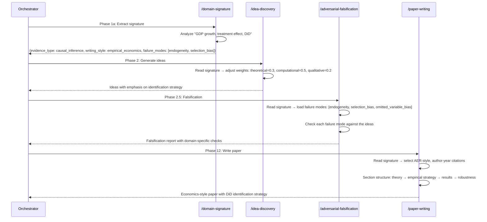

# Domain Signature Consumer Protocol (SciForge-OSS)

> **Status (v2.3 — wiring layer, v2.8 — learner-first downgrade of Phase 1a)**: Defines how every downstream skill consumes the domain signature produced by `/domain-learner` (Phase 1b). This is the **wiring layer** that makes domain adaptation automatic. `/domain-signature` (Phase 1a) is downgraded to an OPTIONAL hint file consumed only by the learner as a prior — downstream skills never read it.
>
> **Core principle**: Every skill reads `.sciforge/refine-logs/domain-signature.json` at startup and adapts its behavior accordingly. No skill hard-codes domain-specific logic.

## Quick Reference

- **Purpose**: Defines how every downstream skill automatically consumes the domain signature
- **Input**: .sciforge/refine-logs/domain-signature.json (from /domain-learner — the single source of truth)
- **Output**: Per-skill adaptive behavior (no manual configuration required)
- **Key**: Every skill reads the signature at startup and adapts automatically; the hint file is never read

## Signature Location

The domain signature is written to `.sciforge/refine-logs/domain-signature.json` by Phase 1b (`/domain-learner`) — the sole writer. Every downstream skill reads this file at startup. Phase 1a (`/domain-signature`) writes a separate `.sciforge/refine-logs/domain-signature-hint.json` consumed ONLY by the learner as a prior; downstream skills MUST NOT read the hint.

## Consumption Rules by Skill

### /idea-discovery — Perspective Weight Adjustment

```json
{
  "signature_consumption": {
    "field": "evidence_type",
    "mapping": {
      "causal_inference": {
        "perspective_weights": {"theoretical": 0.3, "computational": 0.5, "qualitative": 0.2},
        "emphasis": "identification_strategy, robustness_checks"
      },
      "derivational": {
        "perspective_weights": {"theoretical": 0.6, "computational": 0.3, "qualitative": 0.1},
        "emphasis": "proof_structure, theorem_chain"
      },
      "experimental": {
        "perspective_weights": {"theoretical": 0.2, "computational": 0.3, "qualitative": 0.5},
        "emphasis": "protocol_design, statistical_power"
      },
      "simulational": {
        "perspective_weights": {"theoretical": 0.3, "computational": 0.5, "qualitative": 0.2},
        "emphasis": "model_equations, numerical_methods"
      },
      "interpretive": {
        "perspective_weights": {"theoretical": 0.2, "computational": 0.1, "qualitative": 0.7},
        "emphasis": "argument_structure, counter_evidence"
      }
    }
  }
}
```

### /adversarial-falsification — Failure Mode Loading

```json
{
  "signature_consumption": {
    "field": "failure_mode_profile.common_failures",
    "action": "load_failure_modes_from_catalog",
    "catalog_source": "shared-references/domain-failure-modes.md",
    "filter": "by evidence_type",
    "auto_add": true
  }
}
```

### /paper-writing — Style Adaptation

```json
{
  "signature_consumption": {
    "field": "writing_profile",
    "mapping": {
      "style": {
        "empirical_economics": "AER-style: theory → empirical strategy → results → discussion",
        "physical_sciences": "PRL-style: concise, results-first, methods at end",
        "formal_math": "Theorem → Lemma → Proof → Corollary chain",
        "biological_sciences": "Introduction → Methods → Results → Discussion (IMRaD)",
        "interpretive": "Claim → Evidence → Counterargument → Conclusion"
      },
      "citation_format": {
        "author_year": "elsarticle-harv",
        "numeric": "elsarticle-num"
      },
      "section_structure": "auto_selected_from_evidence_type"
    }
  }
}
```

### /discipline-writing — Convention Selection

```json
{
  "signature_consumption": {
    "field": "domain_profile",
    "action": "select_writing_conventions",
    "conventions_source": "shared-references/discipline-writing.md Section 0",
    "auto_apply": true
  }
}
```

### /result-to-claim — Confidence Calibration

```json
{
  "signature_consumption": {
    "field": "data_profile.data_availability",
    "action": "calibrate_grounding_confidence",
    "mapping": {
      "high": "grounding_confidence = theoretical_confidence × 0.9",
      "medium": "grounding_confidence = theoretical_confidence × 0.7",
      "low": "grounding_confidence = theoretical_confidence × 0.4"
    }
  }
}
```

### /result-to-claim — Evidence Sufficiency Calibration (evidence_norm, v6.0)

```json
{
  "signature_consumption": {
    "field": "evidence_norm_profile",
    "action": "calibrate_evidence_sufficiency",
    "mapping": {
      "rule": "a claim's evidence_sufficiency is judged against the DISCIPLINE's bar, not a universal one: sample/scale below sample_size_norm -> sufficiency capped at 'partial'; missing control_design_norm controls -> the claim cannot be 'symbolic/numerical-complete'; effect reported without effect_reporting_norm's expected quantification -> downgrade one fidelity level",
      "unknown_norm": "if evidence_norm_profile says 'unknown — defaulting to conservative', use the conservative built-in bar and flag evidence_norm_missing (WARN, recorded in the claim's grounding note)"
    }
  }
}
```

### /experiment-execution — Matrix Sizing (evidence_norm, v6.0)

```json
{
  "signature_consumption": {
    "field": "evidence_norm_profile.sample_size_norm",
    "action": "size_experiment_matrix",
    "mapping": {
      "rule": "seed counts, run counts, and scale_ratio in the mandatory experiment matrix must reach the discipline's published norm (the toy gate may run smaller, but the FULL matrix must meet the norm, or the shortfall is explicitly justified in BUDGET_FLOOR's completion_justification)",
      "unknown_norm": "default: >= 3 seeds, >= 2 scales, baseline + ablation groups (the method-registry section 3.5 minimums)"
    }
  }
}
```

### /publishability-score — Evidence-Strength Weighting (evidence_norm, v6.0)

```json
{
  "signature_consumption": {
    "field": "evidence_norm_profile",
    "action": "weight_evidence_strength_dimension",
    "mapping": {
      "rule": "the evidence-strength dimension is scored against the discipline's exemplar-venue bar: claims meeting sample_size_norm + control_design_norm + effect_reporting_norm score full; each unmet norm deducts per the skill's rubric; negative_result_norm decides whether a negative-result framing is publishable-as-is or must carry a power analysis",
      "unknown_norm": "score against the conservative default bar and note evidence_norm_missing in the score report"
    }
  }
}
```

### /novelty-check — Threshold Adjustment

```json
{
  "signature_consumption": {
    "field": "domain_profile.primary_domain",
    "action": "adjust_novelty_thresholds",
    "mapping": {
      "mathematics": {"novelty_weight": 0.6, "feasibility_weight": 0.2, "relevance_weight": 0.2},
      "economics": {"novelty_weight": 0.3, "feasibility_weight": 0.4, "relevance_weight": 0.3},
      "physics": {"novelty_weight": 0.4, "feasibility_weight": 0.3, "relevance_weight": 0.3},
      "biology": {"novelty_weight": 0.3, "feasibility_weight": 0.3, "relevance_weight": 0.4},
      "default": {"novelty_weight": 0.5, "feasibility_weight": 0.3, "relevance_weight": 0.2}
    }
  }
}
```

## Skill Startup Protocol

Every skill MUST execute the following at startup:

```
Step 1: Check for .sciforge/refine-logs/domain-signature.json
Step 2: If exists, read the signature
Step 3: Look up the consumption rules for this skill in this protocol
Step 4: Apply the rules (adjust weights, load failure modes, select style)
Step 5: If no signature exists, use default behavior (no domain adaptation)
```

## Fallback

If `.sciforge/refine-logs/domain-signature.json` does not exist:

- All skills use their default behavior (no domain-specific adaptation)
- This is equivalent to `domain: general` in the legacy approach
- The pipeline continues without interruption — the signature is an enhancement, not a requirement

## Example: Economics Problem Flow


```mermaid
sequenceDiagram
    participant O as Orchestrator
    participant DS as /domain-signature
    participant ID as /idea-discovery
    participant AF as /adversarial-falsification
    participant PW as /paper-writing

    O->>DS: Phase 1a: Extract signature
    DS->>DS: Analyze "GDP growth, treatment effect, DiD"
    DS-->>O: {evidence_type: causal_inference, writing_style: empirical_economics, failure_modes: [endogeneity, selection_bias]}
    
    O->>ID: Phase 2: Generate ideas
    ID->>ID: Read signature → adjust weights: theoretical=0.3, computational=0.5, qualitative=0.2
    ID-->>O: Ideas with emphasis on identification strategy
    
    O->>AF: Phase 2.5: Falsification
    AF->>AF: Read signature → load failure modes: [endogeneity, selection_bias, omitted_variable_bias]
    AF->>AF: Check each failure mode against the ideas
    AF-->>O: Falsification report with domain-specific checks
    
    O->>PW: Phase 12: Write paper
    PW->>PW: Read signature → select AER-style, author-year citations
    PW->>PW: Section structure: theory → empirical strategy → results → robustness
    PW-->>O: Economics-style paper with DiD identification strategy
```

## See Also

- [`../meta-skills/domain-signature/SKILL.md`](../meta-skills/domain-signature/SKILL.md) — produces the signature
- [`../shared-references/domain-failure-modes.md`](../shared-references/domain-failure-modes.md) — failure mode catalog
- [`../shared-references/discipline-writing.md`](../shared-references/discipline-writing.md) — writing conventions
- [`../orchestrator/auto-pipeline/SKILL.md`](../orchestrator/auto-pipeline/SKILL.md) — graceful degradation protocol